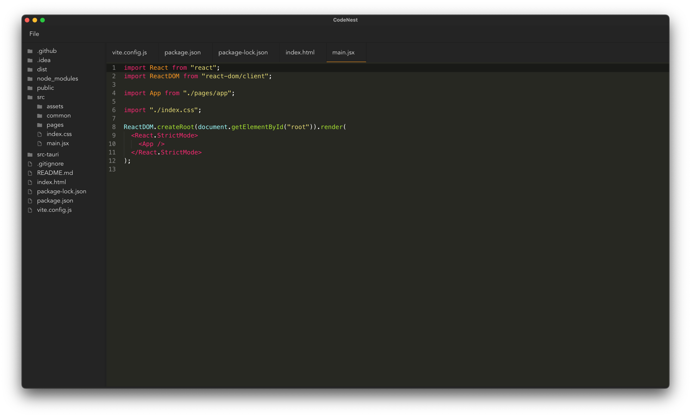

## CodeNest



> **Warning**
>
> CodeNest is work in progress.
> \
> Currently works only if you open project that is on Desktop - _working on this_

> **Note**
> 
>  All PRs are welcome.

- CodeNest is built using React for the front-end, Tauri for the back-end and [codemirror](https://codemirror.net/) under the hood, which allows for a smooth and responsive user experience.
- CodeNest also includes useful developer tools such as syntax highlighting, code completion.
- CSS is used for styling the interface and making it visually appealing, it also allows users to customize the look and feel of the editor to suit their needs and preferences.
- CodeNest is open-source and actively developed, contributions are welcome.

## Why
There are so many editors out there, and then some more. Reason I created CodeNest mainly is to learn.

Maybe it will grow into something much bigger later, but that will only be possible with external
contributions.

## Development
To start project in development mode make sure that you set up tauri correctly. Read the guide [here](https://tauri.app/v1/guides/getting-started/prerequisites)
\
\
First you need to clone this repository
```
git clone https://github.com/M1ck0/CodeNest
```
After that go into `CodeNest` directory, run
```
npm install
``` 
and then 
```
npm run tauri dev
```
This will run development server and the app will start.

## Production
If you want to test release version run
```
npm run tauri build
```
At one moment prompt for app installation will appear. If this does not happen go to `src-tauri/release/bundle/` 
then open directory for your OS and look for the installation file.

## Project structure
- In `src` directory are all files related to React part of the project
- In `src-tauri` directory are all files related to Tauri (Rust) part of the project
  - I don't have Rust knowledge and untill I learn it, I will mostly be in the `src` directory

## Supported files
There files have syntax highlighting enabled. More will be added soon
- `JS`
- `JSX`
- `CSS`
- `SCSS`
- `HTML`
- `JSON`
- `MD`
- `RS`

## Supported themes
- Okaidia

More will come soon

## TODO
- [x] Open file
- [x] Save file
- [x] Add Emmet
- [x] Add support for opening directories
- [x] Rename 'Open' to 'File' with context menu
    - [x] Open file
    - [x] Open directory
    - [ ] Save As
- [ ] User can choose themes
- [ ] User can set font size
- [ ] Make split screen for previewing multiple files at once
- [x] Make sidebar for project files
- [x] Make sidebar resizable
- [ ] Add terminal
- [x] Add tabs

## Consider
- [ ] Add typescript
- [ ] Write tests

### Explanation
I have never written tests or typescript before. I know that this is a downside,
but I want to learn it on this project. It will definitely be added later, but I need
some time to learn it.
